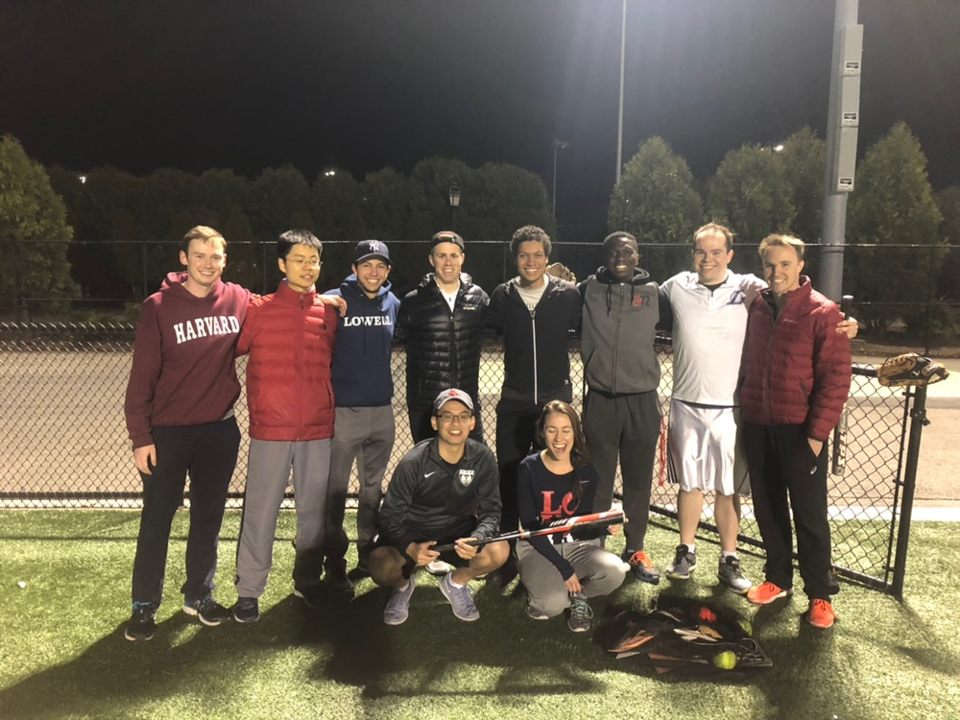

# Little Updates On Me

This is a very basic site meant for giving updates to my friends as to what's going on in my life.
Obviously, this is public, so I won't go very much into details, but feel free to message me personally, and I'll be happy to talk there.

I've realized that I mostly like hearing about my friends' lives when I talk to them, and I don't like talking about my life, so hopefully putting it into a website will help me talk a little bit more :)
Though I do keep a diary of sorts, this will also help keep track of things going on.

# 4/17/2019
- Finals are almost upon me.
- I taught someone how to play piano over this past week. (They only knew how to play guitar and wanted to learn how piano chords work.)
- I might apply for the Harvard Innovation Lab's (iLab) Ingenuity Awards, but I'm not sure if my current idea for Tech Relief (my "startup" in the works) is really all that cool. The deadline is within the next two days though so that will sort itself out. I may decide to pitch something cooler, like having bots that actually stop natural disasters in action.
- Talk to me about relationship stuff.
- My aunt and uncle are going to have a baby which is really exciting! :)
- These past couple days I worked a lot on the Practical Theorem Prover, and got it to prove the isosceles triangle theorem which I'm pretty happy about.
- Some questions on my mind:
    - Why are protesters often times seen as second-class citizens? The rich / people with power don't protest. (Is this true?) Why not? Does this mean that we inherently see protesters as being less powerful / weak / not as important as others? Does this inherently invalidate part of the purpose of protesting?

- Here's an email I sent to the e-sports club here:
> Hello,
> 
> I know I haven't been very active in this community, like, at all, but I have some exciting news to share.
> 
> As some of you may know, over the past year or so, [OpenAI](https://openai.com/) has been working on a [bot that plays 5v5 DOTA](https://openai.com/five/), and just a couple days ago they [beat the world champions](https://www.theverge.com/2019/4/13/18309459/openai-five-dota-2-finals-ai-bot-competition-og-e-sports-the-international-champion), OG. This is the first time that world champions of any e-sport have lost to an AI in a live-streamed game.
> 
> From the [18th to the 21st](https://openai.com/blog/how-to-train-your-openai-five/), OpenAI will be letting anyone (as far as I can tell) play with or against their AIs.
> 
> I'm planning on playing a few games with friends, and just wanted to let you all know about this really cool opportunity.
> 
> They ask that people register [here](https://arena.openai.com/#/register) so that they know how many servers they need to have running their AI in each area.
> 
> Hopefully we can figure out a way to beat them!
> 
> Best,
> London Lowmanstone

- Ooh, I almost forgot, I also introduced one of my friends to VR! She's a fantastic artist, and it was amazing to see her build up worlds from scratch in VR.

So yeah, that's a quick overview of some of the things going on in my life this week.
Hopefully this will work for me better than Snapchat for staying in touch with you all and letting you know what's going on with me.

# 4/18/2019
I love that I don't even have to use a web browser to update this - I just type in my code editor and use git and know that it's been updated. Pretty cool.

Yesterday I played softball in intramurals (IMs). Today I lost my wallet. Now I have to figure out either where my wallet is, or how I'm going to get an ID in order to get home.

I did apply for the Ingenuity Awards with the idea of having people use computers in virtual reality. We'll see what happens.

Some of my friends recommended putting photos on here. I'm not exactly sure how to do that, but I'll try :)

Let's see if this works for displaying the image:

Yay! Looks like it works. Cool. Thanks for the suggestion! :)

Interview tomorrow for another startup-related program that you can only get into as a sophomore. We'll see what happens!

Also, along the lines of the interview, I just had a funny experience that tells you how I plan things for myself. Alarm goes off at midnight with the title "Go to bed" to remind me that I need to go to bed earlier than 2AM (or what has actually lately been closer to 4AM). I snooze it. 9 minutes later, it goes off again. I'm reading a Quora article. (Quora sucks up a lot of time and I get very distracted by it, but also learn a lot of things that can end up being randomly useful.) I snooze the alarm again. Then, at 12:10, a little notification pops up on my phone that says "Interview tomorrow!" And it's at that point that I say out loud "Okaaay, fine!" and close down Quora. Apparently it also takes three alarms to get me to go to bed :P (Also, props to myself for actually setting that reminder. Lack of props to myself for typing this up instead of going to bed.)

# 4/19/2019
Stressed about homework. Played against the DOTA AI today and got crushed. However, me and my friends got 4 kills against it and survived for over 20 minutes, so I'm very happy with that result :)

I did the interview for the [tech fellows cohort](https://www.hbs.edu/mba/seas/Pages/default.aspx) today, and it went super duper well. I'm really hoping I get into it.

Oh, also, in other news, one of the deans of the houses here is the head of the legal defense for Harvey Weinstein. So a lot of people are requesting that he step down. Message me if you'd like to hear my opinions on it.
